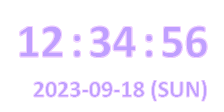


# WallClock
  https://github.com/owlsperspective/wallclock

## 概要
- 設定機能も何もない、シンプルな壁時計です。起動するとメインモニタの右上に時刻と日付、曜日が表示されます。終了するときはタスクトレイアイコンを右クリックして終了を選択します。
- 時計は24時間表記で、毎秒コロン(":")が点滅します。また毎正時の前後2秒間は文字の色が赤くなります。
- 時計の表示はマウス操作を透過します。またマウスカーソルを時計の上に置くと、表示が見えなくならない程度に薄くなります。
- 他のプログラムが(PowerPointのスライドショーのように)全画面表示したり、全画面のDirect3Dアプリケーションが実行されているときは非表示になります。
- ノートPCではバッテリステータス(残量、残り時間)を表示します(Version 1.3以降)。

## 実行環境
- Windows
  Windows 7/8/8.1/10/11で動作するはずです。

## 開発環境
- RAD Stusio (Delphi) 11 Update 3 (11.3) 
  https://www.embarcadero.com/jp/products/delphi
- Skia4Delphi 6.0.0 beta 3 
  https://skia4delphi.org/ 
  https://github.com/skia4delphi/skia4delphi
- 基本的にSkia4Delphiに対応しているDelphi XE7以降のバージョンであればコンパイルできるはずです。またCommunity Editionを含む全てのSKUでコンパイルできます。

    Delphi Community Edition - エンバカデロ・テクノロジーズ 
    https://www.embarcadero.com/jp/products/delphi/starter

## 実行ファイル構成
- 実行ファイル一式はGitHubからダウンロードできます。
  https://github.com/owlsperspective/wallclock/releases

- WallClock.exe(実行プログラム)とsk4d.dll(Skia4Delphi)を同一の場所に配置し、WallClock.exeを実行します。コマンドラインオプションはありません。

## 技術的なポイント
### マウス操作を透過
pikさんの以下の記事そのままです。

[Delphi] 半透明でクリックを透過するウィンドウの作り方 - Qiita 
https://qiita.com/pik/items/71142d607937bc713af2

フォームの`AlphaBlend`プロパティを`True`にすることでLayered Windowにして、`CreateParams`メソッドを`override`して`Params.ExStyle`に`WS_EX_TRANSPARENT`と`WS_EX_NOACTIVATE`を追加することでマウス操作を透過させます。

### 文字の縁取り
デスクトップ上に単に文字を表示すると、デスクトップや下のウィンドウの表示との関係から、常に見やすい色というのは存在しません。そこで文字を濃色として、淡色で縁取りするためにSkia4Delphiの`TSkLabel`を使用しています。

### フォントの選択
英数字だけの表示なので、きれいにアンチエイリアスされる英字フォントとしてCalibriを選択しました。しかしWindows標準の英字フォントはCalibriを含めほとんどがプロポーショナルフォントのため表示内容によって幅が変化してしまい、時計として表示したときに表示位置がちらちらと変化して見づらくなってしまいます。そこで1文字ごとにLabel(`TSkLabel`)を配置しています。

### 文字以外の部分の透過
フォームの`TransparentColor`プロパティをTrueにして、色を`TransparentColorValue`プロパティに設定することで文字以外の部分を透過します。しかしそのままでは縁取りのアンチエイリアスの部分がきれいに透過されません。そこで縁取りの色とフォームの色が極めて近く(RGB各1ビットの違いに)なるようにしています。

### マウスオーバ時の半透過
時計表示の部分はマウス操作が透過しますが、そのままでは時計表示が邪魔をして下に何があるかわからなくなるため、マウスがフォーム上にあるときはフォームの`AlphaBlendValue`プロパティを(段階的に)255から減らして半透過にすることでマウス操作を妨げないようにしています。

### 全画面表示になっているときの非表示
全画面でゲームをしているときなどは時計表示が邪魔なので、フォームの`Visible`プロパティを`False`にして非表示にしています。他のプログラムが全画面を占有しているかどうかは

c++ - Detecting full screen mode in Windows - Stack Overflow 
https://stackoverflow.com/questions/7009080/detecting-full-screen-mode-in-windows

を参考にして、Win32APIの`SHQueryUserNotificationState`で`QUNS_BUSY`または`QUNS_RUNNING_D3D_FULL_SCREEN`が返ってくるかどうかで判定しています。

SHQueryUserNotificationState function (shellapi.h) - Win32 apps | Microsoft Learn 
https://learn.microsoft.com/en-us/windows/win32/api/shellapi/nf-shellapi-shqueryusernotificationstate

QUERY_USER_NOTIFICATION_STATE (shellapi.h) - Win32 apps | Microsoft Learn 
https://learn.microsoft.com/en-us/windows/win32/api/shellapi/ne-shellapi-query_user_notification_state

### タスクバー上にアプリケーション/メインフォームを表示しない
タスクバー上にアプリケーションやメインフォームが表示されても邪魔なだけなので、

delphi - How to hide an application from taskbar in Windows 7? - Stack Overflow 
https://stackoverflow.com/questions/14811935/how-to-hide-an-application-from-taskbar-in-windows-7

にあるように、フォームの`CreateParams`メソッドを`override`して`Params.ExStyle`から`WS_EX_APPWINDOW`を削除するとともに、`PopupMode`プロパティを`pmExplicit`にしています。

### 常に最前面に表示
フォームの`FormStyle`プロパティを`fsStayOnTop`にすることで、常に最前面で表示されるはずなのですが、なにかの拍子で他のプログラムの後ろになってしまうことがあります。そこで全画面解除で`Visble`プロパティを`True`にする、タスクトレイアイコンのクリック、タスクトレイアイコンの右クリックでポップアップメニューが表示される、というタイミングで`HWND_TOPMOST`を指定してWin32APIの`SetWindowPos`を呼び出すことでフォームが最前面を維持するようにしています。

SetWindowPos function (winuser.h) - Win32 apps | Microsoft Learn 
https://learn.microsoft.com/en-us/windows/win32/api/winuser/nf-winuser-setwindowpos

### マルチモニタへの対応と表示位置の調整
Windowsではマルチモニタの構成は動的に変更できますが、Delphiの`Screen.Monitors`はいくつかの特定の状況を除き再構成されず、構成の変更が反映されません。そこで

[RSP-37708] Handles in the TScreen.Monitors list are not updated when Windows sends WM_DisplayChange - Embarcadero Technologies 
https://quality.embarcadero.com/browse/RSP-37708

のコメントにあるworkaroundに従って、必要に応じて`SendMessage(Application.Handle,WM_WTSSESSION_CHANGE,0,0);`で強制的に`Screen.Monitors`を再初期化しています。

`PopupMenu`がポップアップされるたびに、モニタごとのメニューアイテムを`MenuItemMonitors`の下に生成し直しています。

モニタごとのメニューアイテムを選択すると、フォームの位置をそのモニタの`WorkAreaRect`の右上に移動します。またモニタを選択したときはそのハンドルを保持しておきます。

マルチモニタの情報が取得できない(`Screen.Monitors[]`が空の)ときは`Screen.WorkAreaRect`(Win32APIの`SystemParametersInfo`に`SPI_GETWORKAREA`を指定して取得した領域)を使用して表示位置を調整します。

プログラムの起動時にはプライマリモニタが選択されます。また選択されているモニタがなくなった(`Screen.Monitors[]`の中に保存しておいたモニタのハンドルが見つからない)ときもプライマリモニタが選択されます。

`WM_DISPLAYCHANGE`メッセージをハンドルすることでモニタの構成や解像度の変更を検知して、対象モニタや表示位置を再調整します。

### 時計の表示とそれ以外の処理の分離
時計の表示を変更したバリエーションを作成しやすいように、表示以外の処理を継承元フォーム`TFormWallClockBase`に、表示の処理を継承先フォーム`TFormWallClock`に、それぞれ分離しました。
これにより`TFormWallClockBase`から継承したフォームをメインフォームとして、メソッド`Initialize`、`AdjustColors`、`DoShowTime`を`override`するだけで異なる表示のプログラムを簡単に作成できるようにしました。

### バッテリステータスの表示(Version 1.3)
ノートPCではバッテリの残量と残り時間を表示します。

GetSystemPowerStatus function (winbase.h) - Win32 apps | Microsoft Learn 
https://learn.microsoft.com/en-us/windows/win32/api/winbase/nf-winbase-getsystempowerstatus

SYSTEM_POWER_STATUS (winbase.h) - Win32 apps | Microsoft Learn 
https://learn.microsoft.com/en-us/windows/win32/api/winbase/ns-winbase-system_power_status

Win32APIの`GetSystemPowerStatus`で取得した`SYSTEM_POWER_STATUS`構造体の`ACLineStatus`が`AC_LINE_ONLINE`かつ`BatteryLifePercent`が`BATTERY_PERCENTAGE_UNKNOWN`かつ`BatteryLifeTime`が`BATTERY_LIFE_UNKNOWN`のときはデスクトップPCと見なしてバッテリステータスを非表示にします。
一方`BatteryLifePercent`が`BATTERY_PERCENTAGE_UNKNOWN`以外または`BatteryLifeTime`が`BATTERY_LIFE_UNKNOWN`以外のときはノートPCと見なしてバッテリステータスを表示します。

### エクスプローラ再起動時にアプリケーションがタスクバー上に表示されないようにする
Windowsのシェルであるエクスプローラがクラッシュしたりなんらかのツールで設定変更の反映のために再起動されると、せっかく非表示にしたアプリケーション/メインフォームがタスクバー上に表示されてしまいます。そこでタスクバーが(再)作成されるときに送信される`TaskbarCreated`メッセージをハンドルします。このメッセージはIE4のシェル機能で追加されたため`WM_`という形式で定義されておらず、Win32APIの`RegisterWindowMessage`で対応するメッセージを取得する必要があります。

Taskbar Creation Notification (The Taskbar - Win32 apps | Microsoft Learn)
https://learn.microsoft.com/en-us/windows/win32/shell/taskbar#taskbar-creation-notification

RegisterWindowMessageW function (winuser.h) - Win32 apps | Microsoft Learn
https://learn.microsoft.com/en-us/windows/win32/api/winuser/nf-winuser-registerwindowmessagew

フォームのウィンドウプロシージャ`WndProc`をオーバライドし、`TaskbarCreated`メッセージを受信したらフォームの`RecreateWnd`を呼び出してウィンドウを再生成することで、`CreateParams`メソッドをオーバライドして設定される`Params.ExStyle`によってタスクバー上に表示されないようにします。

Vcl.Controls.TWinControl.RecreateWnd - RAD Studio API Documentation
https://docwiki.embarcadero.com/Libraries/ja/Vcl.Controls.TWinControl.RecreateWnd

## 既知かもしれない問題
- HiDPIの対応は単にマニフェストで"Per-Monitor (V2) DPI"を指定しているだけなので、100%以外のスケールでは正しく表示されないかもしれません。

## プログラムの変更について
このプログラムには設定機能が一切存在しないため、何かを変えようとするときはプログラムを変更して再コンパイルする必要があります。DelphiのCommunity Editionは商用でなければ(商用でも一定の範囲で)自由に使用できるため、適宜コードを変更して再コンパイルしてご使用ください。

## ライセンス
このプログラムに固有のコードについてはMITライセンスが適用されます。

Copyright 2023-2024 Owl's Perspective

The MIT License – Open Source Initiative 
https://opensource.org/license/mit/

(日本語参考訳) 
https://licenses.opensource.jp/MIT/MIT.html

Skia4DelphiはMITライセンスの元で公開されています。 
https://github.com/skia4delphi/skia4delphi/blob/main/LICENSE

## 更新履歴
- Version 1.0.0 (2023-09-02)
  - 初期バージョン

- Version 1.1.0 (2023-09-10)
  - マルチモニタ対応を改善。

- Version 1.1.1 (2023-09-14)
  - フルスクリーンのプログラムが検出されなくなったときにプライマリモニタが選択されてしまう不具合(issue #1)を修正。

- Version 1.2.0 (2023-09-15)
  - 視認性向上のため表示色の反転機能を追加。
  - フルスクリーンでも非表示にしない機能を追加(issue #2)。

- Version 1.2.1 (2023-09-16)
  - 色を反転したときに一瞬正しくない色の組み合わせになる不具合を修正。

- Version 1.2.2 (2023-09-18)
  - 時計の表示とそれ以外の処理の分離。

- Version 1.2.3 (2024-01-06)
  - フルスクリーンを無視の反映方法を変更(issue #3)。

- Version 1.2.4 (2024-05-16)
  - TimerUpdateコンポーネントの定義がdfmにのみ存在し、pasファイルになかった不具合を修正(動作上は影響なし)。

- Version 1.3.0 (2024-05-18)
  - ノートPCでバッテリステータスを表示する機能を追加。

- Version 1.3.1 (2024-10-14)
  - カーソルがフォーム上に入ったときにZオーダを最前面に移動するように変更。

- Version 1.3.2 (2024-11-14)
  - エクスプローラが再起動してタスクバーが再作成されたときにアプリケーションがタスクバー上に表示されないように変更。

